<div align="center">

```ascii
   __  __ _ _     _         ____                  _            _   _     _                   
  |  \/  (_) |__ (_)_ __   / ___|_   _ _ __ _   _| | __ _ ___  | | | | __| |_   _ _ __   __ _ 
  | |\/| | | '_ \| | '__| | |  _| | | | '__| | | | |/ _` / __| | | | |/ _` | | | | '_ \ / _` |
  | |  | | | | | | | |    | |_| | |_| | |  | |_| | | (_| \__ \ | |_| | (_| | |_| | |_) | (_| |
  |_|  |_|_|_| |_|_|_|     \____|\__,_|_|   \__,_|_|\__,_|___/  \___/ \__,_|\__,_| .__/ \__,_|
                                                                                  |_|          
```


[](https://portfolio-iota-lemon-19.vercel.app/)
[](mailto:mihir17.udupa@gmail.com)
[](https://linkedin.com/in/mihir-udupa)
[](https://github.com/Mihir611)


</div>

---

## 👨‍💻 About Me

```typescript
const mihir: Developer = {
    location: "Udupi, Karnataka, India",
    role: "Full-Stack Developer",
    code: ["JavaScript", "TypeScript", "Python", "Solidity", "C#", "Go"],
    currentFocus: ["React Native", "React.js", "Web3", "IoT Systems"],
    
    expertise: {
        frontend: ["React", "Next.js", "Svelte", "React Native", "Tailwind CSS"],
        backend: ["Node.js", "Express", "Flask", ".NET"],
        databases: ["MongoDB", "MySQL", "DynamoDB"],
        blockchain: ["Solidity", "Web3.js", "Ethers.js", "Hardhat"],
        iot: ["Arduino", "Raspberry Pi", "Embedded Systems"],
        tools: ["Socket.io", "Redux", "Nginx", "Apache", "Figma", "Adobe XD"]
    },
    
    interests: ["Cybersecurity", "Web3", "IoT", "Real-Time Systems"],
    availableFor: "Full-Time Roles | Freelance Projects | Consulting",
    
    hireable: true
};
```

### 🎯 What I Bring to Your Team

- **🚀 Production-Ready Code**: Built scalable platforms handling real-time data and high concurrency
- **💡 Full-Stack Versatility**: From embedded systems to Web3 dApps, I architect end-to-end solutions
- **⚡ Rapid Prototyping**: Ship MVPs fast with React Native, Next.js, and modern tooling
- **🔐 Security-First**: Deep understanding of cybersecurity principles and secure coding practices
- **🌐 Web3 Native**: Smart contracts, token minting, wallet integration, and decentralized systems
- **📱 Mobile Expertise**: Cross-platform apps with React Native and .NET MAUI

---

## 🛠️ Tech Arsenal

<div align="center">

### Frontend & Mobile


### Backend & Databases


### Blockchain & Web3


### DevOps & Tools


### Design & Prototyping


</div>

---

## 🚀 Featured Projects

<div align="center">

| Project | Description | Tech Stack | Status |
|---------|-------------|------------|--------|
| **[ERC20 Token Generator](https://github.com/Mihir611)** | Custom ERC20 token minting platform on Polygon/Ethereum testnet with MetaMask integration | Svelte, Ethers.js, Web3.js, Solidity | ✅ Live |
| **[WhatsApp Chatbot](https://github.com/Mihir611)** | AI-powered conversational bot for company info & order placement | Node.js, Python, TensorFlow, NLTK, MongoDB | ✅ Production |
| **[E-Commerce Platform](https://github.com/Mihir611)** | Full-featured online store with payment gateway | C#.NET, SQL, Bootstrap | ✅ Deployed |
| **[Intelligent Braking System](https://github.com/Mihir611)** | IoT collision prevention system using distance sensors | Arduino, C++, Sensors | 🔬 Hardware |
| **[Face Recognition System](https://github.com/Mihir611)** | Real-time face detection and identification | Python, OpenCV, ML | ✅ Complete |

</div>

<div align="center">
  
### 📊 More Projects Available
[](https://github.com/Mihir611?tab=repositories)

</div>

---

## 📈 GitHub Analytics

<div align="center">
  


</div>

---

## 💼 Why Hire Me?

<table>
<tr>
<td width="50%">

### 🎯 For Startups
- **Move Fast**: Ship production-grade MVPs in weeks
- **Wear Multiple Hats**: Full-stack + mobile + blockchain + IoT
- **Cost-Effective**: One developer, multiple specializations
- **Startup Mindset**: Comfortable with ambiguity and rapid pivots

</td>
<td width="50%">

### 🏢 For Enterprises
- **Scalable Architecture**: Design systems that grow
- **Best Practices**: Clean code, testing, documentation
- **Team Player**: Excellent communication and collaboration
- **Learning Agility**: Quick to adopt new technologies

</td>
</tr>
</table>

---

## 🎓 Core Competencies

```mermaid
%%{init: {'theme':'forest', 'themeVariables': { 'primaryColor':'#ff0067','primaryTextColor':'#fff','primaryBorderColor':'#ff0067','lineColor':'#00d9ff','secondaryColor':'#1313c6','tertiaryColor':'#0bb93d','fontSize':'16px','fontFamily':'monospace'}}}%%
mindmap
  root((🎯 Mihir Udupa))
    🚀 Full Stack Development
      ⚛️ React Ecosystem
      🟢 Node.js & Express
      ⏭️ Next.js & SSR
      🔌 RESTful APIs
    📱 Mobile Development
      📲 React Native
      🔷 .NET MAUI
      🌐 Cross Platform
    ⛓️ Web3 & Blockchain
      📜 Smart Contracts
      💎 Solidity
      🌟 DApp Development
      🪙 Token Standards
    🔌 IoT & Embedded
      🤖 Arduino & RPi
      📡 Sensor Integration
      ⚡ Real Time Systems
    💾 Database & Backend
      🍃 MongoDB
      🐬 MySQL
      ☁️ DynamoDB
      🔗 Socket Programming
```

<div align="center">



</div>

---

## 📫 Let's Connect

<div align="center">

```javascript
// Reach out for opportunities
const contact = {
    email: "mihir17.udupa@gmail.com",
    portfolio: "https://portfolio-iota-lemon-19.vercel.app/",
    availability: "Immediate",
    timezone: "IST (UTC+5:30)",
    preferredRoles: [
        "Full-Stack Developer",
        "React Native Developer", 
        "Web3 Developer",
        "Blockchain Engineer"
    ]
};

console.log("Let's build something amazing together! 🚀");
```

<br/>

**💡 Open to:**
- Full-Time Positions
- Contract/Freelance Work
- Technical Consulting
- Interesting Side Projects

<br/>

[](mailto:mihir17.udupa@gmail.com)
[](https://portfolio-iota-lemon-19.vercel.app/)

---


---

### 🌟 Support My Work

If you find my projects helpful, consider giving them a ⭐️!

[](https://github.com/Mihir611)

<sub>Built with 💻 and ☕ | Last Updated: December 2025</sub>

</div>

<!-- 
████████████████████████████████████████████████████████████████████████████████
█                                                                              █
█  "Code is like humor. When you have to explain it, it's bad." – Cory House  █
█                                                                              █
████████████████████████████████████████████████████████████████████████████████
-->
